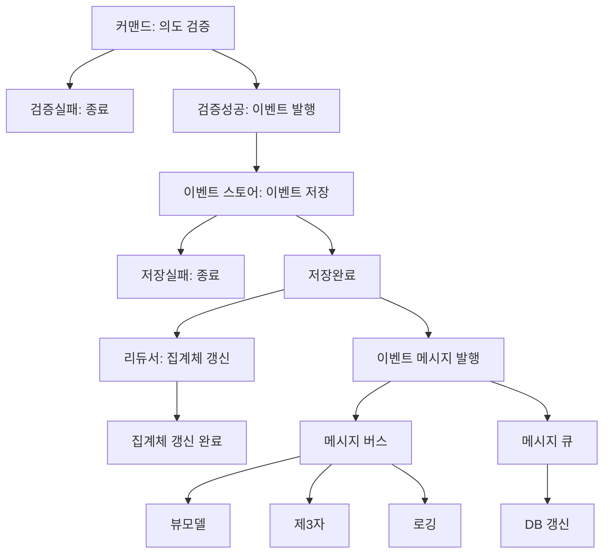

# Game Flip Tile (게임 타일 뒤집기)

타일을 뒤집어 당첨을 찾는 게임 모듈입니다.

UI 요소 관리는 포함되지 않은 순수한 게임 로직 모듈입니다.

서버와 클라이언트 간의 상태 동기화를 위한 CQRS 이벤트 소싱 패턴을 지원합니다.

# 설치

```bash
npm install game-flip-tile
# 또는
yarn add game-flip-tile
# 또는
pnpm add game-flip-tile
```

# 주요 개념

먼저 이 게임 모듈의 동작 개념을 간단하게 알아봅니다.

이벤트 소싱 개념은 다음과 같습니다.

- 이벤트: 발생한 **사건**입니다. 이 **사건**들은 저장소에 영구적으로 기록됩니다.
- 리듀서: **사건**을 해석하고 **집계체**를 갱신합니다.
- 집계체: 마지막 이벤트가 처리된 **상태**입니다. 집계체는 항상 마지막 이벤트가 처리된 상태로 존재합니다.

여기에 CQRS 개념이 추가되어 있습니다.

- 커맨드: **의도**를 타나냅니다. 게임 초기화, 타일 뒤집기 등.. 의도를 처리할 수 있다면 이벤트, 즉 **사건**를 발행합니다. **사건**이 정상적으로 접수(저장)되었다면 메시지를 발행합니다.
- 메시지: 이벤트를 본문으로하며, 큐 또는 버스를 통해서 전달됩니다. 메시지는 이벤트가 성공적으로 저장된 경우에만 발행하며, 큐의 워커나 버스의 구독자들은 메시지를 받아서 몬가... 처리합니다.

`Controller`와 같은 전역적 객체와의 결합을 피할 수 있게 합니다.



- 커맨드 쿼리를 기반으로 **의도**를 처리합니다. 의도가 확인되고 처리가능하다면 이벤트를 발행합니다.
- 이벤트는 커맨드가 이벤트를 발행했다면 **발생 사실** 을 기록합니다. 이벤트는 스토어에 저장됩니다. 이벤트 자체는 상태를 변경하지 않습니다.

# 사용법

### 기본 사용법

```typescript
import { GameService, Prize } from "game-flip-tile";

// 상품 정의
const prizes: Prize[] = [
  { id: 1, name: "1등 상품", value: 1000, quantity: 1 },
  { id: 2, name: "2등 상품", value: 500, quantity: 3 },
  { id: 3, name: "3등 상품", value: 100, quantity: 5 },
];

// 게임 서비스 생성
const gameService = new GameService();

// 게임 보드 생성 (10x10 = 100 타일)
gameService.createBoard({
  tileCount: 100,
  prizes,
});

// 타일 뒤집기 (익명 사용자 ID 제공)
gameService.flipTile(42, "anonymous_user_123");

// 게임 완료 여부 확인
const isComplete = gameService.isGameComplete();

// 발견된 상품 확인
const revealedPrizes = gameService.getRevealedPrizes();
```

### 게임 상태 저장 및 불러오기

```typescript
// 게임 상태 저장
const savedData = gameService.exportGameData();
localStorage.setItem("savedGame", JSON.stringify(savedData));

// 게임 상태 불러오기
const loadedData = JSON.parse(localStorage.getItem("savedGame") || "{}");
gameService.loadGame(loadedData);
```

### 게임 상태 변경 구독

```typescript
// 게임 상태 변경 구독
const unsubscribe = gameService.subscribe((state) => {
  console.log("게임 상태가 변경되었습니다.");

  if (state.isComplete) {
    console.log("게임이 완료되었습니다!");
  }
});

// 구독 해제
unsubscribe();
```

### 커스텀 보드 크기 지정

```typescript
// 너비 지정 (높이는 자동 계산)
gameService.createBoard({
  tileCount: 100,
  width: 20, // 20x5 보드
  prizes,
});

// 높이 지정 (너비는 자동 계산)
gameService.createBoard({
  tileCount: 100,
  height: 10, // 10x10 보드
  prizes,
});
```

## API 참조

### 타입

#### `Tile`

타일 정보를 나타내는 인터페이스입니다.

```typescript
interface Tile {
  id: number;
  isFlipped: boolean;
  prize: Prize | null;
  flippedBy?: string | null; // 어떤 사용자가 뒤집었는지 (ID만 저장)
  flippedAt?: Date | null; // 언제 뒤집었는지
}
```

#### `Prize`

상품 정보를 나타내는 인터페이스입니다.

```typescript
interface Prize {
  id: number;
  name: string;
  value: number;
  quantity: number; // 이 상품이 몇 개의 타일에 배치될지
}
```

#### `GameBoard`

게임 보드 정보를 나타내는 인터페이스입니다.

```typescript
interface GameBoard {
  id: string;
  tiles: Tile[];
  width: number;
  height: number;
  tileCount: number;
  createdAt: Date;
  updatedAt: Date;
}
```

#### `GameState`

게임 상태 정보를 나타내는 인터페이스입니다.

```typescript
interface GameState {
  board: GameBoard;
  logs: GameLog[];
  isComplete: boolean;
  prizes: Prize[];
  settings: GameSettings;
}
```

### 클래스

#### `GameService`

게임 상태를 관리하고 게임 로직을 캡슐화하는 서비스 클래스입니다.

```typescript
class GameService {
  constructor(initialState?: GameState);

  // 상태 관리
  getState(): GameState;
  dispatch(action: GameAction): void;
  subscribe(listener: (state: GameState) => void): () => void;

  // 게임 조작
  createBoard(settings: GameSettings): void;
  flipTile(tileId: number, playerId: string): void;
  restartGame(settings?: GameSettings): void;
  loadGame(savedData: SaveableGameData): void;

  // 게임 정보
  isGameComplete(): boolean;
  getRevealedPrizes(): Prize[];
  exportGameData(): SaveableGameData;
}
```

## 개발

### 설치

```bash
git clone https://github.com/your-username/game-flip-tile.git
cd game-flip-tile
pnpm install
```

### 스크립트

- `pnpm dev`: 개발 모드로 실행
- `pnpm build`: 패키지 빌드
- `pnpm test`: 테스트 실행
- `pnpm lint`: 린트 검사
- `pnpm format`: 코드 포맷팅

## 라이센스

MIT
